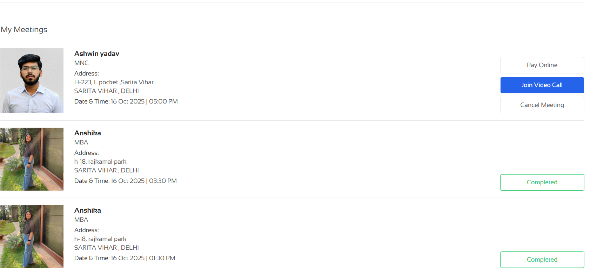
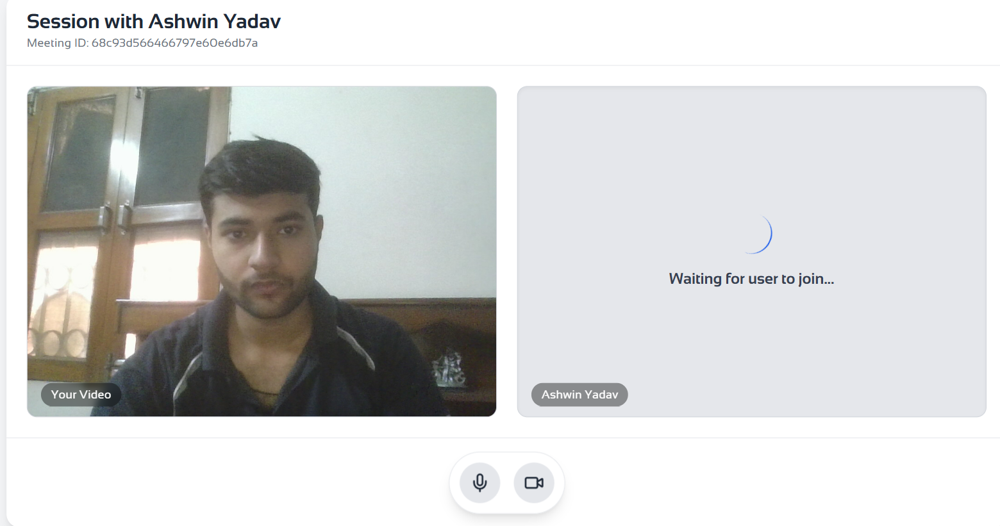
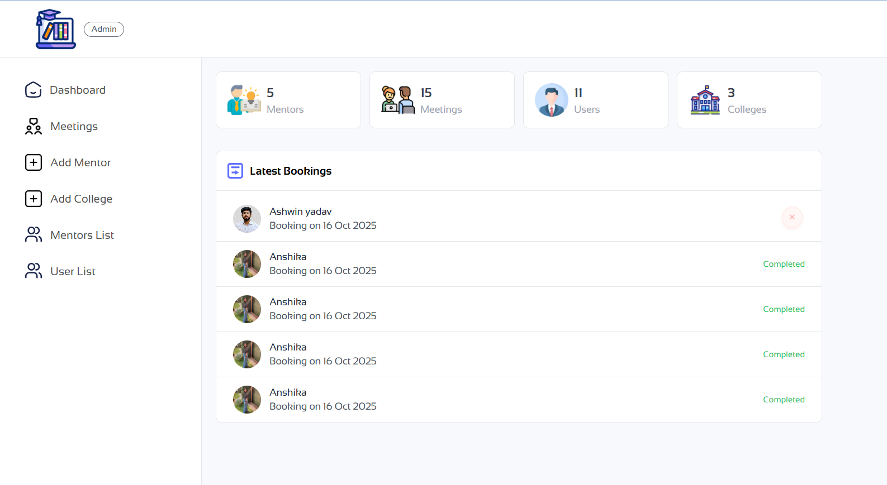

# Progress

**Progress** is a comprehensive MERN-stack platform designed to guide students in discovering the right colleges and careers, connecting them with verified mentors, and streamlining the mentorship and college exploration process. The platform offers:
- One-to-one mentorship sessions with real professionals
- Curated and regularly updated college information
- Secure OTP-based authentication and session management
- Integrated payment gateways for seamless booking
- Admin tools for managing users, mentors, colleges, and transactions

Whether you are a student seeking guidance, a mentor looking to help, or an admin managing educational resources, Progress brings all stakeholders together in a single, user-friendly platform.

---

## 🚀 Features

- ✅ OTP-based sign-up via email for secure authentication
- 🍪 Cookie-based session management
- 📝 Personal dashboard for progress updates
- 📅 Book and cancel mentorship sessions
- 📊 Admin panel to manage colleges, mentors, courses, and users
- 💸 Payment support via Razorpay and Stripe
- ☁️ Media uploads with Cloudinary and ImageKit
- 📧 Gmail-based mailing system (e.g., password recovery)
- 🔐 JWT-based authentication & role-based access
- 🎥 Real-time video meetings using WebRTC and Socket.io

---

## 🛠️ Tech Stack

- **Frontend:** React, Vite, Redux, TailwindCSS
- **Backend:** Node.js, Express.js, REST API
- **Database:** MongoDB (Mongoose)
- **Authentication:** OTP via email, JWT, Cookies
- **Payments:** Razorpay, Stripe
- **Storage:** Cloudinary, ImageKit
- **Mailing:** Nodemailer + Gmail
- **Deployment:** Vercel
- **Real-time:** WebRTC, Socket.io

---

## 📁 Project Structure

```
Progress/
├── backend/         # API and server logic
├── frontend/        # User interface (students)
├── admin/           # Admin dashboard
├── socket_backend/  # WebRTC signaling server (Socket.io)
```

---

## 📸 Sample Screenshots

> Add your screenshots in the appropriate locations below:

- **User Dashboard**
  
  

- **Meeting Room**
  
  

- **Book Meetings Page**
  
  

- **Admin Dashboard**
  
  

---

## 📄 Environment Variables

> **Note:** All environment variables are stored securely and not included in this repository. Below is a reference format you can use to create your `.env` files.

### 🔧 Backend `.env`

CURRENCY="INR"
JWT_SECRET="your_jwt_secret"

# Admin Login
ADMIN_EMAIL="your_admin_email"
ADMIN_PASSWORD="your_admin_password"

# MongoDB
MONGO_URI="your_mongodb_connection_string"

# Cloudinary
CLOUDINARY_NAME="your_cloudinary_name"
CLOUDINARY_API_KEY="your_cloudinary_api_key"
CLOUDINARY_SECRET_KEY="your_cloudinary_secret_key"

# Razorpay
RAZORPAY_KEY_ID="your_razorpay_key_id"
RAZORPAY_KEY_SECRET="your_razorpay_key_secret"

# Stripe
STRIPE_SECRET_KEY="your_stripe_secret_key"

# Gmail (Nodemailer)
GMAIL_USERNAME="your_gmail"
GMAIL_PASSWORD="your_gmail_app_password"

# ImageKit
IMAGEKIT_URL_ENDPOINT="your_imagekit_endpoint"

NODE_ENV="production"

### 🔧 Frontend `.env`

VITE_BACKEND_URL="http://localhost:4000"
VITE_RAZORPAY_KEY_ID="your_razorpay_key_id"

### 🔧 Admin `.env`

VITE_CURRENCY="₹"
VITE_BACKEND_URL="http://localhost:4000"

---

## 🧪 Getting Started

1. **Clone the Repository**

```bash
# Clone the repo and enter the directory
```

2. **Start the Backend**

```bash
cd backend
npm install
npm run dev
```

3. **Start the Frontend**

```bash
cd ../frontend
npm install
npm run dev
```

4. **Start the Admin Panel**

```bash
cd ../admin
npm install
npm run dev
```

5. **Start the Signaling Server**

```bash
cd ../socket_backend
npm install
node signaling-server.js
```

---

## 📌 Admin Access

Navigate to `http://localhost:5174`

Login with your configured admin email and password

---

## 🎓 Related Project: CollegeSearch

📎 **Link:** (https://progress-b8v3.vercel.app/)

🛠 **Stack:** Node.js, Express, React, Redux, MongoDB, REST API, TailwindCSS

📅 **Duration:** March 2024 – Present

**Highlights:**

- 🔐 Implemented OTP-based sign-up to reduce spam and ensure user authenticity
- 👥 One-to-one mentorship system with session booking and cancellation
- 🎓 Detailed college profiles, course listings, likes, and wishlists
- 🧑‍💻 Admin Portal to manage mentors, courses, transactions, and users
- 💳 Seamless payments via Razorpay and Stripe
- 🍪 Cookie-based session persistence for improved UX

---

## 🤝 Contributing

Contributions are welcome!
Feel free to fork the repo and submit a pull request.

```bash
git checkout -b feature/my-feature
git commit -m "Add new feature"
git push origin feature/my-feature
```

---

## 📄 License

This project is licensed under the MIT License.

---

## 👨‍💻 Author

**Prabhat Sehrawat**  
📧 prabhatsahrawat010203@gmail.com  
🔗 [LinkedIn](https://www.linkedin.com/in/prabhatsahrawat/)
